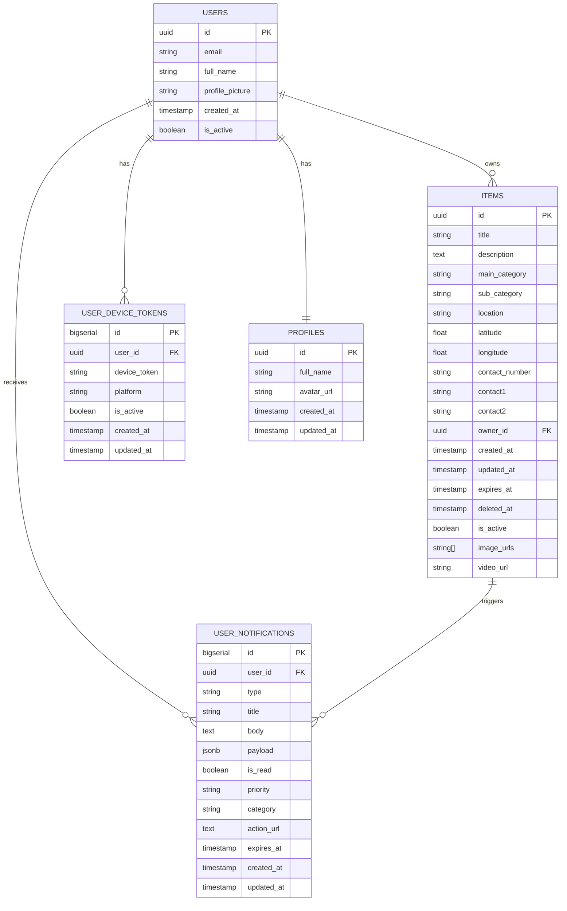
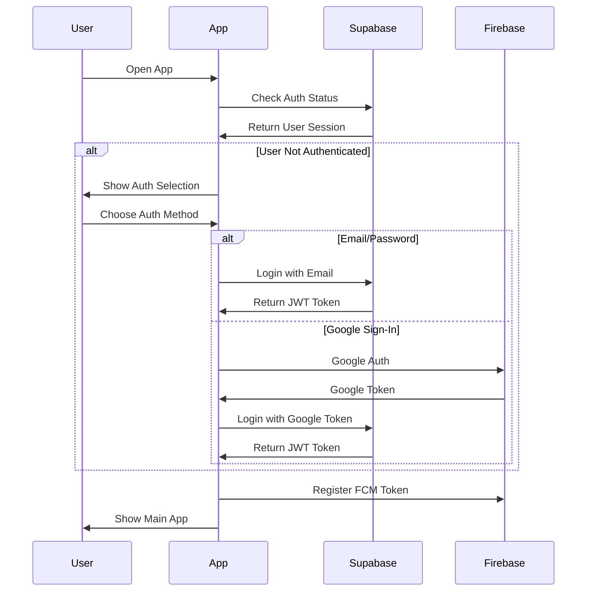
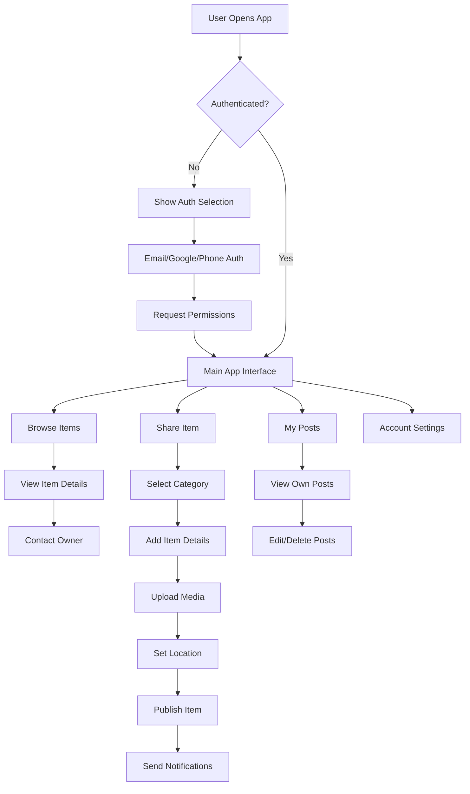

# 📱 MADADGAR - Comprehensive Project Documentation

## 🎯 Project Overview

**MADADGAR** (meaning "Helper" in Hindi/Urdu) is a community-driven Android application designed to facilitate sharing and connection within local communities. The app's mission is to create a platform where people can share resources, connect with neighbors, and help each other within their community.

### Core Mission
- **Reduce Waste**: Enable sharing of items instead of discarding them
- **Build Community**: Connect people within local areas
- **Foster Helping Culture**: Create a platform for mutual assistance
- **Sustainable Living**: Promote reuse and sharing economy

---

## 🏗️ System Architecture

### High-Level Architecture
```
┌─────────────────┐    ┌─────────────────┐    ┌─────────────────┐
│   Android App   │    │    Supabase     │    │    Firebase     │
│   (Java/Kotlin) │◄──►│   (Backend)     │◄──►│   (FCM)         │
└─────────────────┘    └─────────────────┘    └─────────────────┘
         │                       │                       │
         │                       │                       │
         ▼                       ▼                       ▼
┌─────────────────┐    ┌─────────────────┐    ┌─────────────────┐
│   UI Layer      │    │   PostgreSQL    │    │   Push Notif.   │
│   (Activities/  │    │   Database      │    │   Service       │
│   Fragments)    │    │                 │    │                 │
└─────────────────┘    └─────────────────┘    └─────────────────┘
```

### Technology Stack

#### **Frontend (Android)**
- **Language**: Java (primary) + Kotlin (utilities)
- **UI Framework**: Android Views with Material Design 3
- **Architecture**: MVVM + Repository Pattern
- **Navigation**: Bottom Navigation + Fragment-based navigation
- **Dependency Injection**: Hilt/Dagger

#### **Backend & Database**
- **Backend-as-a-Service**: Supabase
- **Database**: PostgreSQL (via Supabase)
- **Authentication**: Supabase Auth
- **Storage**: Supabase Storage for media files
- **Real-time Updates**: Supabase Realtime

#### **Push Notifications**
- **Firebase Cloud Messaging (FCM)**
- **Real-time Push Notifications**
- **In-app Notifications**

---

## 📊 Database Schema & ER Diagrams

### Entity Relationship Diagram



### Database Tables Schema

#### **1. Users Table (auth.users - Supabase Auth)**
```sql
-- Managed by Supabase Auth
CREATE TABLE auth.users (
    id UUID PRIMARY KEY DEFAULT gen_random_uuid(),
    email TEXT UNIQUE NOT NULL,
    full_name TEXT,
    profile_picture TEXT,
    created_at TIMESTAMPTZ DEFAULT NOW(),
    updated_at TIMESTAMPTZ DEFAULT NOW(),
    is_active BOOLEAN DEFAULT TRUE
);
```

#### **2. Items Table**
```sql
CREATE TABLE items (
    id UUID DEFAULT gen_random_uuid() PRIMARY KEY,
    title TEXT NOT NULL,
    description TEXT,
    main_category TEXT NOT NULL,
    sub_category TEXT NOT NULL,
    location TEXT NOT NULL,
    latitude FLOAT8,
    longitude FLOAT8,
    contact_number TEXT NOT NULL,
    contact1 TEXT,
    contact2 TEXT,
    owner_id UUID NOT NULL REFERENCES auth.users(id) ON DELETE CASCADE,
    created_at TIMESTAMPTZ DEFAULT NOW(),
    updated_at TIMESTAMPTZ DEFAULT NOW(),
    expires_at TIMESTAMPTZ,
    deleted_at TIMESTAMPTZ,
    is_active BOOLEAN DEFAULT TRUE,
    image_urls TEXT[],
    video_url TEXT
);
```

#### **3. User Notifications Table**
```sql
CREATE TABLE user_notifications (
    id BIGSERIAL PRIMARY KEY,
    user_id UUID NOT NULL REFERENCES auth.users(id) ON DELETE CASCADE,
    type VARCHAR(50) NOT NULL,
    title VARCHAR(255) NOT NULL,
    body TEXT NOT NULL,
    payload JSONB,
    is_read BOOLEAN NOT NULL DEFAULT false,
    priority VARCHAR(20) DEFAULT 'normal',
    category VARCHAR(50),
    action_url TEXT,
    expires_at TIMESTAMPTZ,
    created_at TIMESTAMPTZ NOT NULL DEFAULT NOW(),
    updated_at TIMESTAMPTZ NOT NULL DEFAULT NOW()
);
```

#### **4. User Device Tokens Table**
```sql
CREATE TABLE user_device_tokens (
    id BIGSERIAL PRIMARY KEY,
    user_id UUID NOT NULL REFERENCES auth.users(id) ON DELETE CASCADE,
    device_token TEXT NOT NULL,
    platform VARCHAR(20) DEFAULT 'android',
    is_active BOOLEAN DEFAULT TRUE,
    created_at TIMESTAMPTZ DEFAULT NOW(),
    updated_at TIMESTAMPTZ DEFAULT NOW()
);
```

#### **5. Profiles Table**
```sql
CREATE TABLE profiles (
    id UUID PRIMARY KEY REFERENCES auth.users(id) ON DELETE CASCADE,
    full_name TEXT,
    avatar_url TEXT,
    created_at TIMESTAMPTZ DEFAULT NOW(),
    updated_at TIMESTAMPTZ DEFAULT NOW()
);
```

### Database Indexes
```sql
-- Items table indexes
CREATE INDEX idx_items_owner_id ON items(owner_id);
CREATE INDEX idx_items_main_category ON items(main_category);
CREATE INDEX idx_items_sub_category ON items(sub_category);
CREATE INDEX idx_items_location ON items(location);
CREATE INDEX idx_items_created_at ON items(created_at DESC);
CREATE INDEX idx_items_is_active ON items(is_active);
CREATE INDEX idx_items_expires_at ON items(expires_at);

-- User notifications indexes
CREATE INDEX idx_user_notifications_user_id ON user_notifications(user_id);
CREATE INDEX idx_user_notifications_created_at ON user_notifications(created_at DESC);
CREATE INDEX idx_user_notifications_is_read ON user_notifications(is_read);
CREATE INDEX idx_user_notifications_type ON user_notifications(type);

-- Device tokens indexes
CREATE INDEX idx_user_device_tokens_user_id ON user_device_tokens(user_id);
CREATE INDEX idx_user_device_tokens_device_token ON user_device_tokens(device_token);
CREATE INDEX idx_user_device_tokens_is_active ON user_device_tokens(is_active);
```

---

## 🔐 Authentication & Security

### Authentication Flow


### Security Features
- **JWT Token Authentication** with automatic refresh
- **Row Level Security (RLS)** policies
- **Input Validation** and sanitization
- **TLS/SSL** encryption for all communications
- **Runtime Permission Management**

---

## 📱 App Features & User Journey

### Core Features

#### **1. Authentication System**
- **Multiple Sign-in Options**:
  - Email/Password authentication
  - Google Sign-In integration
  - Phone number verification (OTP)
- **Secure Session Management**
- **Password Reset** functionality

#### **2. Item Sharing System**
- **Comprehensive Item Posting**:
  - Title, description, and category selection
  - Photo gallery support (up to 6 photos)
  - Video attachment capability
  - Location-based posting with GPS integration
  - Contact information management

#### **3. Category Management**
- **Food Categories**:
  - Cooked Food
  - Uncooked Food
  - **Smart Expiry System**: Automatic deletion after set time
- **Non-Food Categories**:
  - Electronics
  - Furniture
  - Books
  - Clothing
  - Other items

#### **4. Advanced Notification System**
- **Real-time Push Notifications** via FCM
- **In-app Notifications** for user interactions
- **Smart Filtering**: Users don't receive notifications for their own posts
- **Notification Categories**:
  - New listings in your area
  - Item deletions
  - Community updates

### User Journey Flow



---

## 🎨 UI/UX Design

### Design System
- **Material Design 3** guidelines
- **Accessibility-first** approach
- **Responsive Design** for different screen sizes
- **Dark/Light Theme Support**

### Color Scheme
- **Primary Color**: Aston Green (#1B5E20)
- **Accent Colors**: Material color palette
- **Background**: White/Light Gray
- **Text**: Dark Gray (#333333)

### Key UI Components
- **Custom Card Layouts** for item display
- **Bottom Sheets** for actions and details
- **Material Dialogs** for confirmations
- **Floating Action Buttons** for primary actions
- **Progress Indicators** for loading states

---

## 🔧 Technical Implementation

### Project Structure
```
MADADGARApp/
├── app/
│   ├── src/main/
│   │   ├── java/com/example/madadgarapp/
│   │   │   ├── activities/          # Main activities
│   │   │   ├── adapters/            # RecyclerView adapters
│   │   │   ├── auth/                # Authentication
│   │   │   ├── config/              # App configuration
│   │   │   ├── di/                  # Dependency injection
│   │   │   ├── dialogs/             # Custom dialogs
│   │   │   ├── fragments/           # UI fragments
│   │   │   ├── models/              # Data models
│   │   │   ├── repository/          # Data access layer
│   │   │   ├── services/            # Background services
│   │   │   ├── ui/                  # UI components
│   │   │   └── utils/               # Utility classes
│   │   └── res/                     # Resources
│   └── build.gradle.kts
├── gradle/
└── build.gradle.kts
```

### Key Dependencies
```gradle
// AndroidX Core
androidx.appcompat:appcompat:1.6.1
androidx.activity:activity-ktx:1.8.2
androidx.fragment:fragment-ktx:1.6.2
androidx.constraintlayout:constraintlayout:2.1.4

// Material Design
com.google.android.material:material:1.11.0

// Supabase SDK
io.github.jan-tennert.supabase:postgrest-kt:2.6.0
io.github.jan-tennert.supabase:gotrue-kt:2.6.0
io.github.jan-tennert.supabase:realtime-kt:2.6.0
io.github.jan-tennert.supabase:storage-kt:2.6.0

// Firebase
com.google.firebase:firebase-bom:32.7.0
com.google.firebase:firebase-auth-ktx
com.google.firebase:firebase-messaging-ktx

// Dependency Injection
com.google.dagger:hilt-android:2.50

// Image Loading
com.github.bumptech.glide:glide:4.16.0
```

---

## 🚀 Performance & Optimization

### Performance Optimizations
- **Lazy Loading** of fragments and data
- **Image Caching** with Glide
- **Database Connection Pooling**
- **Request Caching** for frequently accessed data
- **Image Compression** before upload
- **Pagination** for large data sets

### Memory Management
- **Proper Lifecycle Management**
- **Efficient Notification Handling**
- **Background Tasks** minimized
- **Location Services** optimized for battery life

---

## 🧪 Testing Strategy

### Testing Pyramid
- **Unit Tests**: Repository, ViewModel, Utilities
- **Integration Tests**: Database operations, API calls
- **UI Tests**: Fragment interactions, Navigation flow
- **End-to-End Tests**: Complete user workflows

### Testing Tools
- **JUnit 5** for unit testing
- **Espresso** for UI testing
- **Mockito** for mocking dependencies
- **Truth** for assertions

---

## 📈 Deployment & CI/CD

### Build Configuration
```gradle
android {
    compileSdk 35
    
    defaultConfig {
        minSdk 23
        targetSdk 35
        versionCode 1
        versionName "1.0"
    }
    
    buildFeatures {
        viewBinding true
    }
}
```

### Environment Setup
1. **Firebase Project** setup with FCM
2. **Supabase Project** with database and auth
3. **Google Services** configuration
4. **API Keys** and credentials setup

---

## 🔮 Future Enhancements

### Planned Features
- **Chat System**: Direct messaging between users
- **Rating System**: User and item ratings
- **Advanced Search**: AI-powered recommendations
- **Community Events**: Local community event sharing
- **Delivery Integration**: Coordinate item pickup/delivery
- **Multi-language Support**: Hindi, Urdu, and regional languages

### Technical Improvements
- **Jetpack Compose** migration for modern UI
- **Kotlin Multiplatform** for iOS version
- **GraphQL** for more efficient API queries
- **ML Kit** for image recognition and categorization
- **AR Features** for item visualization

---

## 📊 Analytics & Monitoring

### Key Metrics
- **User Engagement**: Daily/Monthly active users
- **Item Sharing**: Number of items posted per day
- **Community Growth**: User registration rate
- **Success Rate**: Items successfully shared/claimed
- **Retention Rate**: User return rate after first use

### Technical Metrics
- **App Performance**: Load times, crash rates
- **Notification Delivery**: Push notification success rate
- **API Response Times**: Backend performance metrics
- **User Satisfaction**: App store ratings and reviews

---

## 🌍 Community Impact

### Social Benefits
- **Waste Reduction**: Promotes reuse over disposal
- **Community Building**: Connects neighbors and localities
- **Economic Support**: Helps people access needed items affordably
- **Environmental Impact**: Reduces consumption and waste

### Target Audience
- **Primary**: College students, young professionals (18-35)
- **Secondary**: Families, elderly community members
- **Geographic**: Urban and suburban communities in India initially
- **Economic**: All economic segments with smartphone access

---

## 🔐 Privacy & Data Protection

### Data Handling
- **Minimal Data Collection**: Only necessary information
- **User Consent**: Clear permission requests
- **Data Encryption**: All sensitive data encrypted
- **Right to Delete**: Users can delete their data
- **GDPR Compliance**: European data protection standards

### Privacy Features
- **Location Privacy**: General area only, not exact coordinates
- **Contact Protection**: Controlled sharing of contact information
- **Anonymous Browsing**: Browse without revealing identity
- **Data Export**: Users can export their data

---

## 📞 Support & Documentation

### User Support
- **In-app Help**: Comprehensive help sections
- **Community Guidelines**: Clear usage policies
- **Report System**: Easy reporting of inappropriate content
- **Customer Support**: Direct support channels

### Developer Resources
- **Documentation**: Comprehensive setup guides
- **API Documentation**: Complete Supabase integration guides
- **Contributing Guidelines**: Open source contribution framework
- **Issue Tracking**: GitHub-based issue management

---

## 🏆 Competitive Advantages

### Unique Features
- **Community-Focused**: Local community emphasis
- **Smart Expiry**: Automatic food item management
- **Comprehensive Media**: Photos + videos support
- **Real-time Notifications**: Instant community updates
- **Free Platform**: No transaction fees or premium features

### Technical Excellence
- **Modern Architecture**: Scalable and maintainable codebase
- **Performance Optimized**: Fast, responsive user experience
- **Security First**: Enterprise-grade security measures
- **Cross-platform Ready**: Architecture supports future expansion

---

## 📋 API Documentation

### Supabase API Endpoints

#### **Authentication**
```kotlin
// Sign in with email
supabase.gotrue.loginWith(Email) {
    email = "user@example.com"
    password = "password"
}

// Sign in with Google
supabase.gotrue.loginWith(OAuthProvider.GOOGLE) {
    redirectTo = "com.example.madadgarapp://auth-callback"
}
```

#### **Items API**
```kotlin
// Get all items
val items = supabase.postgrest["items"].select()

// Create new item
val newItem = supabase.postgrest["items"].insert(item)

// Update item
val updatedItem = supabase.postgrest["items"]
    .update(item) { eq("id", itemId) }

// Delete item
supabase.postgrest["items"].delete { eq("id", itemId) }
```

#### **Notifications API**
```kotlin
// Get user notifications
val notifications = supabase.postgrest["user_notifications"]
    .select { eq("user_id", userId) }

// Mark notification as read
supabase.postgrest["user_notifications"]
    .update({ set("is_read", true) }) { eq("id", notificationId) }
```

---

## 🎯 Conclusion

**MADADGAR** represents a comprehensive solution for community-driven resource sharing, built with modern Android development practices and a focus on user experience, security, and social impact. The app leverages cutting-edge technologies while maintaining simplicity and accessibility for users of all technical backgrounds.

The combination of robust backend infrastructure (Supabase), reliable authentication systems, real-time notifications, and intuitive UI design creates a platform that not only meets technical requirements but also fulfills its social mission of building stronger, more connected communities.

With its scalable architecture and planned enhancements, MADADGAR is positioned to grow from a local community tool to a significant platform for sustainable living and community building across diverse geographic and cultural contexts.

---

**Thank you for exploring MADADGAR! 🙏**

*Building communities, one shared item at a time.* ✨

---

## 📚 Additional Resources

### Documentation Files
- `APP_DOCUMENTATION.txt` - Detailed app documentation
- `SUPABASE_SETUP_GUIDE.md` - Supabase configuration guide
- `PUSH_NOTIFICATIONS_SETUP_GUIDE.md` - FCM setup guide
- `BOTTOM_NAVIGATION_GUIDE.md` - Navigation implementation
- `DELETE_FEATURE_IMPLEMENTATION.md` - Delete functionality guide

### Database Scripts
- `user_notifications_schema.sql` - Notifications table schema
- `supabase_migration_add_location.sql` - Location fields migration
- `add_delete_columns.sql` - Delete functionality columns
- `complete_user_notifications_setup.sql` - Complete notifications setup

### Configuration Files
- `google-services.json` - Firebase configuration
- `build.gradle.kts` - Project dependencies
- `AndroidManifest.xml` - App permissions and components 

